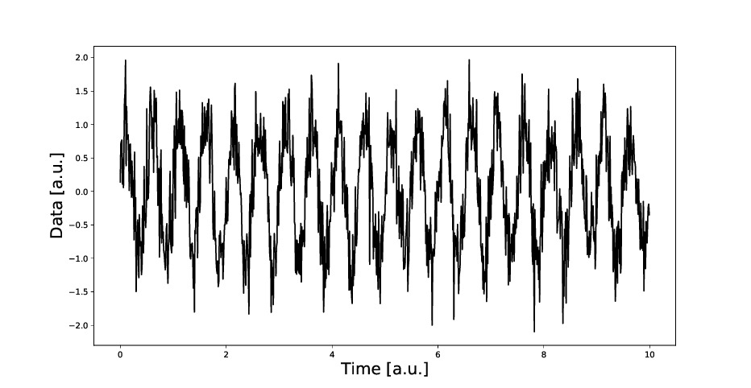
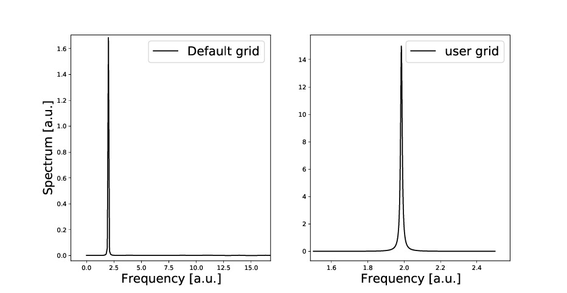
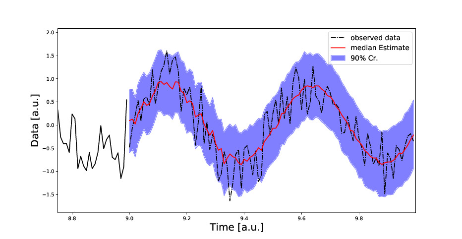
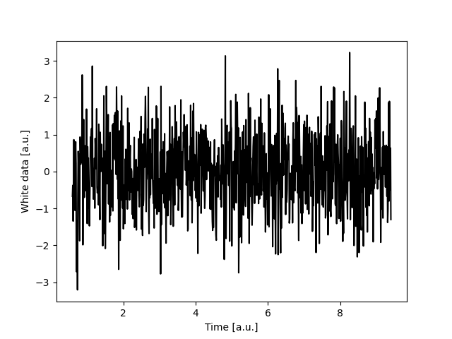

**Authors** Alessandro Martini, Stefano Schmidt, Walter del Pozzo

**emails** martini.alessandr@gmail.com, stefanoschmidt1995@gmail.com, walter.delpozzo@ligo.org

**Copyright** Copyright (C) 2024 Alessandro Martini

**Licence** CC BY 4.0

**Version** 1.3.0

# MAXIMUM ENTROPY SPECTRAL ANALYSIS FOR ACCURATE PSD COMPUTATION

`memspectrum` is a package for the computation of power spectral densitiy (PSD) of time series. 
It implements a fast numpy verion of the Burg method for Maximum Entropy Spectral Analysis.
The method is fast and reliable and shows better performance than other standard methods.

The method is based on the maximum entropy principle, and it allows to make minimal
 assumptions on unavailable information. Furthermore, it provides a beautiful link between spectral 
 analysis and the theory of autoregressive processes.

The PSD is expressed in terms of a set of coefficients a_k plus an overall scale factor P.
The a_ks are obtained recursively through the Levinson recursion.
The knowledge of such coefficients allows to characterize the observed time series in terms of 
an autoregressive process of order p (AR(p)), being p + 1 the lenght of the a_k array.
The a_k coefficients are the autoregressive coefficients, while the P scale factor can be interpreted 
as the variance of white noise component for the process. 
The a_k coefficients are found to be the "best linear predictor" for the time series under study,
their computation via the former method is equivalent to a least square fitting with an autoregressive
process of order p (AR(p)). They are computed with an algorithm called Levinson recursion, which also return a "P" coefficient that is equivalent to the variance of the white noise component for the process. The description is stationary by construction. 
Once the link with an AR(p) process is established, high quality forecast for the time series is straightforward.

## Installation & documentation

To install the package:

```Bash
pip install memspectrum
```

It requires `numpy` and `scipy`.

Useful links:

 - The full [documentation](https://maximum-entropy-spectrum.readthedocs.io/en/latest/).
 - Github [repository](https://github.com/martini-alessandro/Maximum-Entropy-Spectrum)
 - PyPI package - [`memspectrum`](https://pypi.org/project/memspectrum/)
 - Method [paper](https://arxiv.org/abs/2106.09499)

On this repository, you can find a number of examples:

* [gwstrain.py](https://github.com/martini-alessandro/Maximum-Entropy-Spectrum/blob/main/examples/gwstrain.py): computes the PSD on a piece of gravitational waves data and perform some forecasting
* [sunspots.py](https://github.com/martini-alessandro/Maximum-Entropy-Spectrum/blob/main/examples/sunspots.py): using data from sunspots, it uses memspectrum to find an autoregressive process which describes them and forecast
* [sound_MESA.py](https://github.com/martini-alessandro/Maximum-Entropy-Spectrum/blob/main/examples/sound_MESA.py): given an input audio (wav) file reproducing the sound of a waterfall, it computes the PSD and generate a synthetic noise, resembling the original one.
* [generate_white_noise.py](https://github.com/martini-alessandro/Maximum-Entropy-Spectrum/blob/main/examples/generate_white_noise.py): it samples white (gaussian) noise from the the power spectral density of advanced [LIGO](https://www.ligo.caltech.edu/)
* [doc_examples.py](https://github.com/martini-alessandro/Maximum-Entropy-Spectrum/blob/main/examples/doc_examples.py): gather all the piece of code used throughout the documentation, so that you can run all of them at once.

For more advanced use, you can use the code help functionalities:

```Python
import memspectrum
help(memspectrum)
help(memspectrum.<function_name>)
```

## Usage of `memspectrum`

To compute the PSD, the following steps are required

+ Import the `data`
+ Import `memspectrum` and create an instance of `MESA` class:


```Python
from memspectrum import MESA
m = MESA()
```

+ Compute the autoregressive coefficients via the `solve()` method (*required* for further computations)

```Python
m.solve(data)
```

+ At this point you can compute the spectrum and forecast N future observations

```Python
spec, frequencies = m.spectrum(dt)
predicted_data = m.forecast(data, N)
```

## Example 

To compute (and plot) the spectrum of a (noisy) sinusoidal signal:
```Python
from memspectrum import MESA 
import numpy as np
import matplotlib.pyplot as plt
```

Generating the data: 
```Python
N, dt = 1000, .01  #Number of samples and sampling interval
time = np.arange(0, N) * dt
frequency = 2  
data = np.sin(2 * np.pi * frequency * time) + np.random.normal(.4, size = 1000) 
plt.plot(time, data, color = 'k')
```
	

   
   
   
Solving MESA is needed to compute PSD or forecast. 

```Python
M = MESA() 
M.solve(data) 
```

The spectrum can be computed on sampling frequencies (automatically generated) or on 
some given interval 

```Python
spectrum, frequencies = M.spectrum(dt)  #Computes on sampling frequencies 
user_frequencies = np.linspace(1.5, 2.5)
user_spectrum = M.spectrum(dt, user_frequencies) #Computes on desired frequency grid
```
	
The two spectra look like


  
### Forecasting
   
MESA can also be used to perform forecasting the future observation of a time series. For example, we consider the first 900 points 
of the data and try to infer the upcoming signal. 1000 simulations of 100 points are performed.
Real observed data are compared with median estimate and 90% Credibility regions 

```Python
M = MESA() 
M.solve(data[:-100]) 
forecast = M.forecast(data[:-100], length = 100, number_of_simulations = 1000, include_data = False) 
median = np.median(forecast, axis = 0) #Ensemble median 
p5, p95 = np.percentile(forecast, (5, 95), axis = 0) #90% credibility boundaries
	
plt.plot(time[:-100], data[:-100], color = 'k')
plt.fill_between(time[-100:], p5, p95, color = 'b', alpha = .5, label = '90% Cr.') 
plt.plot(time[-100:], data[-100:], color = 'k', linestyle = '-.', label = 'Observed data') 
plt.plot(time[-100:], median, color = 'r', label = 'median estimate') 
```

The forecast result is: 



### Whitening

The autoregressive coefficients come very handy to whiten the data: it's just a convolution between the data and the coefficient. This is implemented in function `MESA.whiten`:

```Python
white_data = M.whiten(data, trim = None)
plt.plot(time[M.get_p():-M.get_p()], white_data, color = 'k')
```

You can tune how to remove the edge effects by setting the trim option (it you set `None`, you will remove p points from the timeseries).
Here's how the white data look like:




## Generating data from PSD

The module ``memspectrum.GenerateTimeSeries`` provides a function that construct a time-series with a user-given power spectral density. It can be called as 

```Python
from memspectrum.GenerateTimeSeries import generate_data
f, psd = (whathever psd and frequency array you like)
time, time_series, frequency, frequency_series,
psd = generate_data(f, psd, T, sampling_rate)
```
	
where T represents the time length of the observation and the sampling rate is equivalent to the inverse of the sampling interval.
 

## References

- Original description of Burg's algorithm: [J.P. Burg - Maximum Entropy Spectral Analysis](http://sepwww.stanford.edu/data/media/public/oldreports/sep06/)

- Fast implementation of Burg's algorithm:  [V. Fastubrg - A Fast Implementation of Burg Method](
https://svn.xiph.org/websites/opus-codec.org/docs/vos_fastburg.pdf)

- Paper describing this work: [Maximum Entropy Spectral Analysis: a case study](https://arxiv.org/abs/2106.09499)

## About

This project is a master thesis of Alessandro Martini at the University of Pisa. A paper is published on [ArXiv](https://arxiv.org/abs/2106.09499) and it is currently under peer review.

If you feel that you need to know more about the code, or you just want to say hi, feel free to contact one of the authors.
