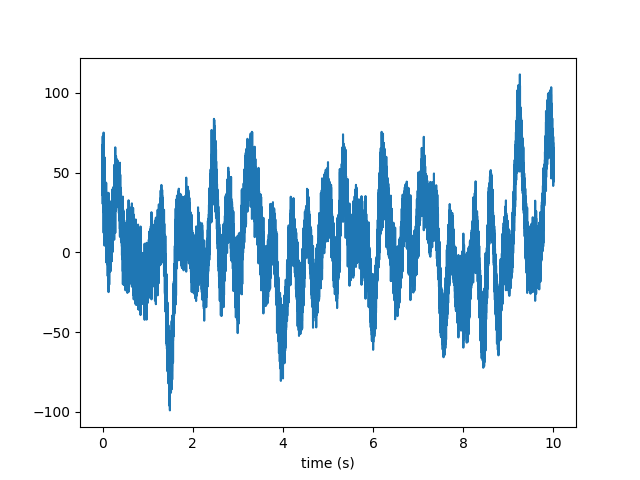

# Overview


`memspectrum` is a package which perform [spectral analysis](https://en.wikipedia.org/wiki/Spectral_analysis) using the Maximum Entropy principle. In practice, this is done using the Burg's algorithm.

The goal of spectral analysis is to compute the Power Spectral Density (PSD) of a given timeseries. In the contex of Maximum Entropy Spectral Analysis (MESA) the time series is represented as an [autoregressive process](https://en.wikipedia.org/wiki/Autoregressive_model) {math}`AR(p)`. The autoregressive coefficients are fitted to the data by the Burg's algorithm and an analytical expression for the PSD is available from the coefficients. This method is the natural consequence of applying the maximum entropy principle to the problem of spectral estimation.

Besides the elegance of the theoretical framework, Maximum Entropy Spectral Analysis requires very little tuning of the hyperparameter. In fact, only 
the length {math}`p` of the autoregressve process is needed to fully specify the PSD of a given stretch of data. Tuning such parameter is not easy and we implemented several methods to do so: we call them *optimizers*. You can find more details [here](theory.md#Choosing-the-right-AR-order).

For more details on the theoretical framework, you can read [some more theory](theory.md#some-theory) or our method paper: [Maximum Entropy Spectral Analysis: a case study](https://arxiv.org/abs/2106.09499).
For practical examples on how to perform spectral analysis, you can read the [next section](#how-to-use-memspectrum) or check out the [examples](https://github.com/martini-alessandro/Maximum-Entropy-Spectrum/tree/main/examples) in our [repository](https://github.com/martini-alessandro/Maximum-Entropy-Spectrum/). 

## Basic usage

The basic object is that performs Maximum Entropy Spectral Analysis is called [`MESA`](../package_reference/mesa.rst#memspectrum.memspectrum.MESA). The class stores the autoregressive coefficients ``a_r`` as well as the variance ``P`` of the white noise and it provides methods to compute the PSD and to fit the autoregressive model to some given data.

At the most basic level, you can use the class to compute the spectrum of some data as follow:

```Python
import memspectrum

m = memspectrum.MESA()
m.solve(data)

f, PSD = m.spectrum(dt =1)
```

## Doing something more...

Of course, the package has more features and options available. Let's take a tour of them!

First, we need some data. They can be any timeseries, but here we use an utility function ``generate_data`` to generate some noise from a given PSD.
For our experiments, we choose a parabola in the log-log space.

```Python
import numpy as np
	
T, srate = 10., 4096.
f_grid_analytic = np.linspace(.1, 4096., 1000)
psd_analytic = 1e-10*np.exp((np.log(f_grid_analytic)- np.log(20))**2)
```

We are now read to generate the time series data. Function ``generate_data`` returns the timeseries as well as its frequency domain version; it also returns the grids over which the time and frequency series are evaluated and the PSD interpolated on the frequency grid of the data.

```Python
from memspectrum.GenerateTimeSeries import generate_data
t_grid, time_series, f_grid, frequency_series, interpolated_psd = generate_data(f_grid_analytic, psd_analytic, T, srate)
```

Here are the generated data:



We can now use the data to estimate the PSD and compare it with the input PSD:

```Python
import memspectrum

m = memspectrum.MESA()
m.solve(time_series, method = 'Burg', optimisation_method = 'VM')
f_mesa, psd_mesa = m.spectrum(dt = 1./srate, onesided = True)
```

The result looks great:


The two PSD agree nicely at high frequencies. Of course, the time series is not long enough to provide a nice estimation of the low frequency PSD...

You must have noted the extra arguments in ``MESA.solve``.
Argument ``method`` specifies the algorithm to use to compute the autoregressive coefficients. You can use the original algorithm (``Standard``) or a [fast implementation](https://opus-codec.org/docs/vos_fastburg.pdf) (``Fast``). The latter method can be numerically unstable: if you receive a warning or you see weird results, you may want to use the safer ``Standard`` method.

The argument ``optimisation_method`` controls the optimization criteria to be used to select the autoregressive order. The best two options (also documented in the paper) are ``VM`` and ``FPE`` but other are available (use them at your own risk!). If you want to impose a priori a constant autoregressive order, you can do so by using the method ``Fixed`` and setting the option ``m`` to your favourite autoregressive order. The iteration will stop there.

### Whitening

You can use the MESA object also to withen a timeseries. This is done by convolving the vector of autoregressive coefficients with the data.

```Python
white_time_series = m.whiten(time_series, trim = 0)
```


Of course you see some edge effect in the whitened data: you can control how you trim the data by playing with the ``trim`` option.
If set to ``None`` (default), it will remove ``p`` points from both sides of the timeseries. Indeed, running the code below will produce a much better time series:

```Python
white_time_series = m.whiten(time_series)
```


If the whitening worked nicely, the whitened timeseries is just gaussian noise (i.e. a flat spectrum). Since white noise does not have time correlation, the autoregressive order must be 0: you can check this with the following snippet:

```Python
m = memspectrum.MESA()
m.solve(white_time_series)
print(m.p)
```

### Generating noise

An autoregressive model is also a probabilistic model {math}`p(x_{[0:T]})` for a timeseries {math}`x_{[0:T]}`. We can then sample from it to generate some data that share the same properties as the original ones.

```Python
_, fake_time_series, _, _, _ = m.generate_noise(T, sampling_rate = srate)
```

You can generate multiple instances of fake data with argument ``N_series`` and you can control the low and high frequency cutoff for the generated data (with arguments ``fmin``, ``fmax``).
The generated noise has the same PSD as the original time series data:


### Forecasting

You can also use the MESA to forecast, i.e. to predict future observations given the past (in formula {math}`p(x_{[t:T]}|x_{[0:t]})`).
To predict the future thousands observations:

```Python
forecast = m.forecast(time_series[:-1000], length = 1000, number_of_simulations = 2000)
```

The function will compute the observation at time t using the {math}`AR(p)` model and iterate over the different times. Since this is a random process, it is better to perform the same operation multiple times (setting option ``number_of_simulations``): we can then explore the probability distribution for the forecasted points. You can also compare the forecasting prediction with the actual value of the timeseries:


