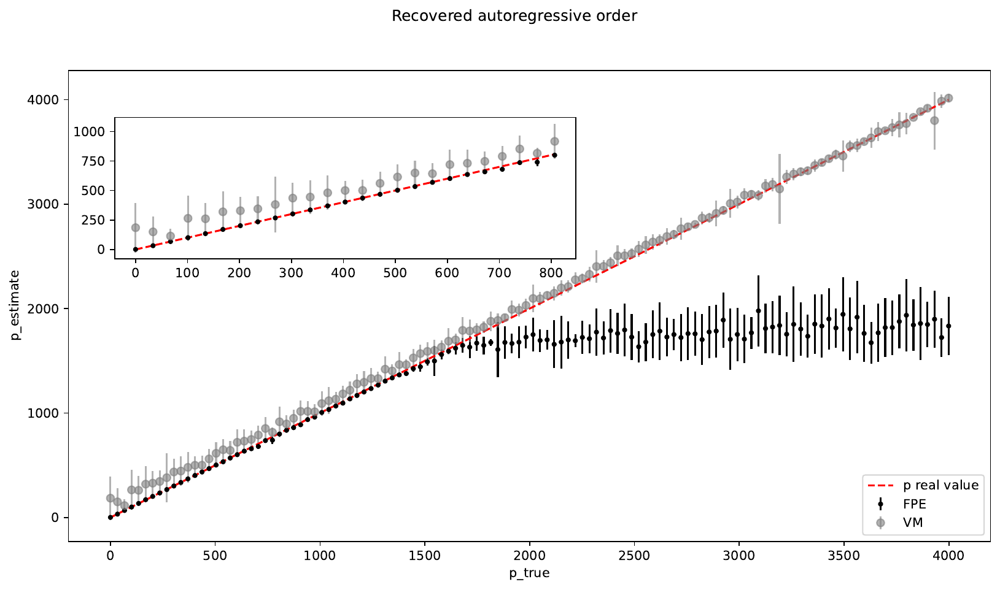

# More details on MESA

We briefly discuss here some theoritical of Maximum Entropy Spectral Analysis (MESA). After we will dig into the issue on how to determine the right autoregressive order for the problem at hands.
For more details, you are encouraged to look at the [paper](https://arxiv.org/abs/2106.09499) we published.

## Some theory

The Power Spectral Density (PSD) is, by definition, the fourier transform of the autocorrelation function {math}`C(\tau) = \mathbf{E}_t[x_t \cdot x_{t+\tau}]` of a time series {math}`x_t`.

In the discrete case, the autocorrelation function is describe by a _finite_ set of coefficients {math}`r_k = C(\tau_k)`, evaluated on an equally spaced time grid. In principle, the autocorrelation extends to infinite time; in practice, due to a finite observation time, we only have access to the first {math}`N` of such coefficients for a timeseries of {math}`N` points.
MESA relies on the [maximum entropy principle](https://en.wikipedia.org/wiki/Principle_of_maximum_entropy) to compute the PSD {math}`S(f)` such that:
- it matches the known autocorrelation coefficients: {math}`\int_{-Ny}^{Ny} S(f) e^{\imath 2 \pi f k \Delta t} df = r_{k}`
- it makes minimal assumptions about the un-known coefficients

The two requirements above are translated into a variational problem, which admits analytical solution for the PSD {math}`S(f)` in terms of a set of coefficients {math}`a_k`:

```{math}
 S(f) = \frac{P_N \Delta t}{\left\vert 1 + \sum_{k = 1}^p a_k e^{\imath 2 \pi f k \Delta t} \right\vert ^ 2}
```

The coefficients {math}`a_k`, together with the scale factor {math}`P_N`, can be computed iteratively with the Burg's algorithm.

The expression above is the equivalent to the PSD of an autoregressive (AR) process with white noise variance {math}`P_N` and AR coefficients {math}`b_k = - a_k`. This gives us a simple interpretation of Burg's algorithm: it fits an autoregressive process of order p {math}`AR(p)` to a given timeseries. The PSD is then assumed to be the one of the {math}`AR(p)` model.

The number {math}`p` of autoregressive coefficients, also called _autoregressive order_, is the only free parameter of the model and its choice is crucial for an accurate PSD estimation.

## Choosing the right AR order

We address here the problem of how to set the autoregressive order.

We begin by noting that there is not a general rule to estimate the "right" AR order: several strategies will work in different situations and whether a method is suitable or not depends on the desidered application.
Here we just show how the different strategies implemented in ``memspectrum`` can lead to different results. Once you are aware of all the subtleties, you (as a user of the package) are the best person to decide which strategy works best.

To set the AR order, we solve the recursion for the {math}`a_k` for many different value or AR order {math}`p`. For each AR order, we evaluate a loss function, which can depend on the data and on the {math}`a_k`. We then select the AR order that minimises the chosen loss functions.

Two losses are implemented:
- **FPE**: implements the Akaike Final prediction Error. In practice, {math}`FPE = P_N \frac{N + p + 1}{N - p - 1}`, where {math}`N` is the length of the timeseries.
- **VM**: at each step it computes the variance of the prediction error associated to forecasting. 

In the following plot, you can see the performance of the two losses at recovering the true AR order of a timeseries:



From the plot you can see that:
- For low AR orders (i.e. for a timeseries with a short autocorrelation), FPE is more accurate and VM tends to overestimate the true AR order
- For high AR orders (i.e. for a timeseries with long autocorrelation length), VM provides an accurate estimation while FPE underestimates the true AR

## Executive summary

- Use FPE if you want a simple PSD (not many details) or you are analysing a simple timeseries
- Use VM to capture many details of the PSD (sometimes at the cost of overfitting)


